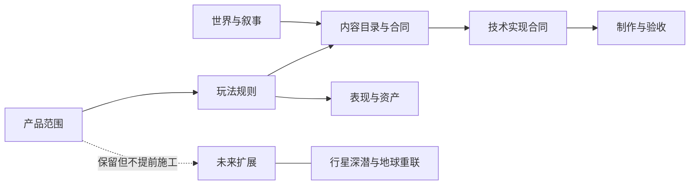

# BREACH: ECHO · 裂界残响

**一款 1–4 人合作 PvE 游戏：进入危险设施，在有限资源下改变战场，并设法全员撤离。**

本仓库目前保存游戏设计、技术与生产文档，不是可玩的 Unity 项目。2026-09-05 基线确定了一条可实施方向，并列出仍需项目所有者裁决的事项。文档中的决定不代表已经编码、试玩、完成许可审查或接受独立评审。

## 从这里开始

| 你的身份 | 先读 | 然后读 |
|---|---|---|
| 项目所有者 | [入门说明](docs/从这里开始.md) | [仅需所有者裁决的事项](docs/治理/项目所有者裁决清单.md) |
| 新程序员或编码智能体 | [贡献者规则](AGENTS.md) | [实施交接](docs/制作/实施交接与制作入口.md)，再读当前任务的责任文档 |
| 设计、美术、写作或测试人员 | [文档总览](docs/文档总览.md) | [首发范围](docs/产品/产品范围与首发合同.md)与[完整文档登记](docs/治理/完整文档登记.md) |
| 需要审查某项决定的理由 | [决策登记](docs/治理/当前决策登记.md) | 该条目链接的决策记录与证据 |

当前要讨论和处理的工作见[待办清单](docs/制作/待办清单.md)：只保留未完成事项，完成后移除；正式规则仍在各责任文档。

## 当前方向

基础版是一至四人合作战术行动（Operation），未来的深潜模式（Descent）不与基础版同时制作。玩家从共享任务板选择合同，在程序组合的设施中侦察、处理休眠敌人、操纵设施、完成目标并撤离。任务与资源有限，已唤醒的敌人持续追杀；只有任务公开声明的警报或节点激活可以投入额外有限敌人。

每人携带两个平等枪槽、专用近战、团队工具与个人战术装置。具体候选见[装备目录](docs/内容/装备/装备完整候选库与首发筛选.md)，实际首轮范围见[装备原型计划](docs/制作/首轮装备原型与验证计划.md)。候选不是量产承诺；数值与乐趣还未通过试玩。

世界真实历史与玩家收藏进度分开。四名外勤员在正史中存活，普通任务不推进个人战役或永久节点版图。客观历史主因果、人格框架与四组双语代号已批准；人物经历、关系、收藏事实、外貌与声音仍有待审内容。

当前不启动Unity实现。先处理[准备度中的合同缺口](docs/制作/游戏开发准备度与责任覆盖矩阵.md)，完成整体体验审阅。引擎、联机、模组与安全方案查[技术栈](docs/技术/Unity与Steam模组技术栈.md)，无需为了理解游戏先读协议规格。

### 想了解什么，就读哪份

| 问题 | 阅读入口 |
|---|---|
| 一局到底怎么玩？ | [完整行动循环](docs/玩法/系统化战术行动模式.md) |
| 有哪些任务？ | [任务候选](docs/内容/任务/任务候选全集与兼容框架.md) |
| 能带哪些装备？ | [装备总入口](docs/内容/装备/装备完整候选库与首发筛选.md) |
| 故事到底发生了什么？ | [完整故事总览](docs/世界与叙事/完整故事总览.md) |
| 先做什么、还缺什么？ | [实施交接](docs/制作/实施交接与制作入口.md)、[开发准备度](docs/制作/游戏开发准备度与责任覆盖矩阵.md) |
| 某个规则为什么这样定？ | [当前决策登记](docs/治理/当前决策登记.md) |

设计规则、具体内容、技术实现、测试证据分别维护；链接不是另一份规则。历史资料只用于核查，不是入门必读。

## 文档架构

这张图表达责任与依赖方向，不把全部 Markdown 挤成无法阅读的节点墙。可交互版本提供责任域聚焦、深浅主题与导出：[打开交互式文档架构](docs/文档架构图.html)。全部文件及其阶段、责任人和依赖见[完整文档登记](docs/治理/完整文档登记.md)。

## 保留的未来规划

[行星深潜](docs/未来扩展/深潜未来模式.md)保留抵达异族行星后开展 Roguelike 远征的方向；[遗物与融合](docs/未来扩展/深潜遗物与融合候选.md)完整保存构筑候选；[地球重联与持续扩充](docs/未来扩展/地球重联与持续扩展规划.md)保存后续故事、武器与活动方向。它们不是废案，也不是基础版当前施工任务。

## 文档维护

所有现行维护文档使用中文叙述和直接说明主题的中文文件名；稳定的代码、API、产品名和协议标识保留原文。文件名不使用数字或字母流水号前缀，版本属于 Git 与元数据，不写成 `最终版7` 一类文件名。Vault 默认使用相对 Markdown 链接，因此 Obsidian 与 GitHub 都能正常导航。

在仓库根目录运行 `python3 tools/validate_docs.py` 与 `python3 tools/docs_audit.py`。它们验证文档结构并维护清单，不是游戏测试。两份外部输入的原始来源快照保存在 [docs/sources](docs/sources/证据登记与覆盖限制.md)，为保持证据完整性不会翻译或覆盖；它们不是现行设计文档。当前规则只由索引中的设计、技术和生产责任文档拥有。
