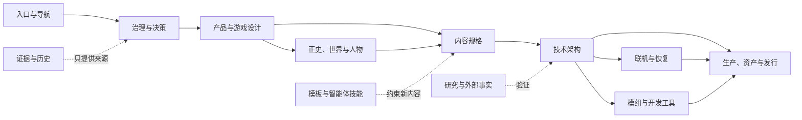

# BREACH: ECHO · 裂界残响

**一款 1–4 人合作 PvE 游戏：进入危险设施，在有限资源下改变战场，并设法全员撤离。**

本仓库目前保存游戏设计、技术与生产文档，不是可玩的 Unity 项目。2026-09-05 基线确定了一条可实施方向，并列出仍需项目所有者裁决的事项。文档中的决定不代表已经编码、试玩、完成许可审查或接受独立评审。

## 从这里开始

| 你的身份 | 先读 | 然后读 |
|---|---|---|
| 项目所有者 | [入门说明](docs/start-here.md) | [仅需所有者裁决的事项](docs/governance/project-owner-decision-queue.md) |
| 新程序员或编码智能体 | [贡献者规则](AGENTS.md) | [实施交接](docs/production/implementation-handoff.md)，再读当前任务的责任文档 |
| 设计、美术、写作或测试人员 | [文档总览](docs/README.md) | [首发范围](docs/production/release-scope.md)与[完整文档登记](docs/governance/document-register.md) |
| 需要审查某项决定的理由 | [决策登记](docs/governance/decision-register.md) | 该条目链接的决策记录与证据 |

## 当前方向

`Operation` 是基础版唯一模式；`Descent` 属于未来扩展，不与首发版本同时制作。实现基线为 Unity 6.3 LTS、URP、GameObject 优先的 C#、主机权威命令、60 Hz 模拟、语义快照/事件复制、Steam Workshop 内容包，以及通过 Gate 后才启用的 Luau Core 沙箱。不支持社区 DLL 或可执行模组。技术依赖的唯一选择见[技术栈](docs/technical/unity-steam-and-modding-technology-stack.md)，不得从旧提案另装竞争框架。

四名固定角色在正史中存活。普通任务不会推进个人战役，也不会永久改变节点征服地图。玩家携带两把枪、一件工具和一个自由选择的战术模块；有限补给、武器改装、设施决策与共享重装备构成局内变化。法杖、无限遗物累积和自动融合不属于 `Operation` 规则。

首发责任域已经整理为唯一文档入口；[开发准备度矩阵](docs/production/development-readiness-matrix.md)列出玩法、任务、敌人、角色、AI、程序生成、摄像机、网络、资产和发行各自还缺的是实现、试玩、审阅还是外部证据。当前下一项不是继续横向写设想，而是按[实施交接](docs/production/implementation-handoff.md)建立 M0 Unity 灰盒。

## 文档架构

这张图表达责任与依赖方向，不把 88 份 Markdown 挤成无法阅读的节点墙。可交互版本提供责任域聚焦、深浅主题与导出：[打开交互式文档架构](docs/documentation-architecture.html)。全部文件及其阶段、责任人和依赖见[完整文档登记](docs/governance/document-register.md)。

## 文档维护

所有现行维护文档使用中文叙述，稳定的代码、API、产品名和协议标识保留原文。文件名继续使用可搜索的英文 kebab-case；版本属于 Git 与元数据，不写成 `final-v7` 一类文件名。

在仓库根目录运行 `python3 tools/validate_docs.py` 与 `python3 tools/docs_audit.py`。它们验证文档结构并维护清单，不是游戏测试。两份外部输入的原始来源快照保存在 [docs/sources](docs/sources/evidence-register.md)，为保持证据完整性不会翻译或覆盖；它们不是现行设计文档。当前规则只由索引中的设计、技术和生产责任文档拥有。
