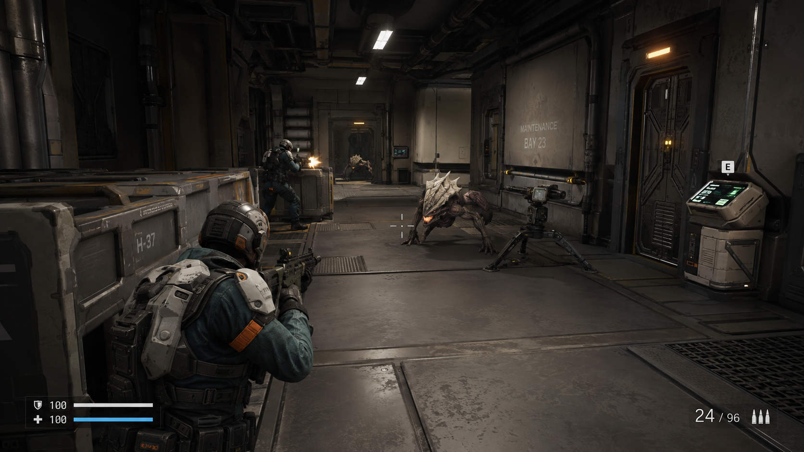
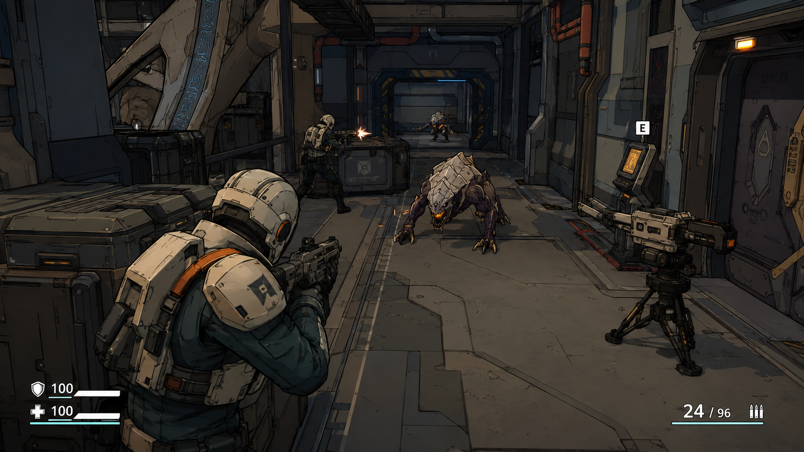
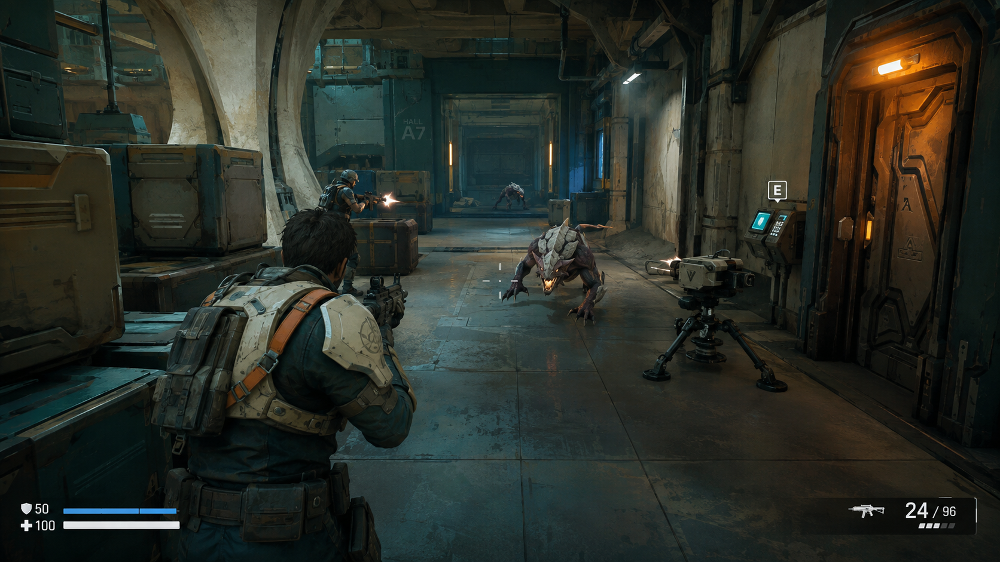
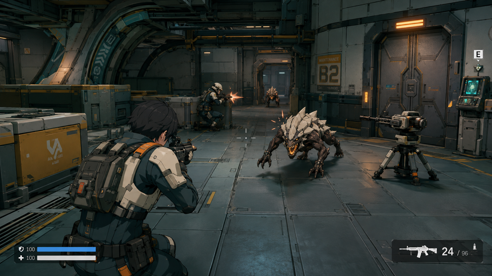
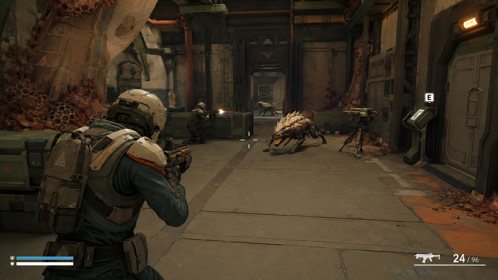
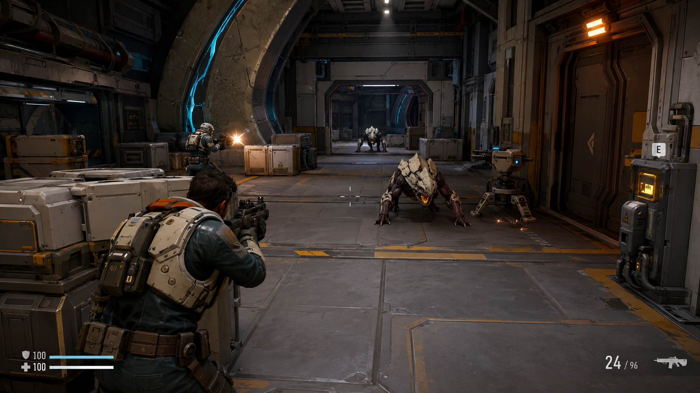

# 六种美术风格对照图

ART-STYLE-IMAGES · PROPOSED。所有者指出首组图片偏影视插画后，本页主图已全部重做为游戏画面概念。每张包含玩家、队友、两个敌人、武器、掩体、终端、门与炮塔，以三维关卡中的交战情境比较风格。

肩后视角用于同时展示人物和场景，不改变项目第一人称玩法要求。HUD、护甲图标、数值与按键均为构图示意，不新增护甲系统或批准界面设计。图片不是实机截图，也不能证明引擎画质、性能、模型或动画已经实现。人物与敌人均为临时设计，正式身份和外观继续待定。

本轮比较轮廓、材质、色阶、角色与场景的统一程度，以及战斗中的辨识度。六图使用相近的空间和镜头要求，但生成结果不是严格控制变量的渲染基准。先看图中的实际效果，再选择需要推进的方向。

六张图片由内置 `image_gen.imagegen` 分别生成并逐张查看。完整提示词、文件尺寸、SHA-256和检查状态见[本轮生成参数](../assets/visual-direction/gameplay-style-comparison-2026-09/生成参数.json)。[首组生成记录](../assets/visual-direction/style-comparison-2026-09/生成参数.json)保留为未获接受的探索历史，不再作为本页主比较。

## A · 战术写实游戏

可信比例、金属与织物的材质区分、克制的磨损和照明。重点看近景装备与中远处敌人的清晰度；复杂表面细节仍需实际预算验证。

## B · 硬朗卡通渲染游戏

清楚的轮廓线、分段明暗与简化材质，直接作用在三维人物、敌人和模块场景上。重点看暗处轮廓与交战时的辨识度。

## C · 绘画感半写实游戏

三维体积配合绘画感底色、较大的色块和受控表面纹理。重点看笔触是否服务形体。

## D · 三维动漫游戏

动漫式头发与角色明暗、简洁装备和清楚的三维空间。重点看人物与设施是否属于同一套视觉语言；图中外貌不确定正式角色身份。

## E · 简洁异星探索游戏

简化形体、偏哑光的材质、矿物与异星生长物，强调可读的三维探索场景。当前样图的工业细节仍较多，简洁程度尚可继续降低。

## F · 分层工业科幻游戏

受控细节的工业设施、人类维修构件与非人类结构分层。当前结果和A仍较接近，只能比较图中的实际效果，不能据此认为两条路线已充分拉开。

## 下一步

审阅这组游戏画面方向后，为选中方向制作中性光单件图和正侧背规范样张，再分别验证模型、绑定与动作。场景图不直接作为Meshy单物体输入；本次未使用Meshy积分或生成3D模型。

起始提交为 `2ff5bfbf19498bd8406b244ab80e56d9f056efa4`；本次新增图像制品并更新对应文档，未创建Git提交。文档与文件检查不等于模型或游戏验证。